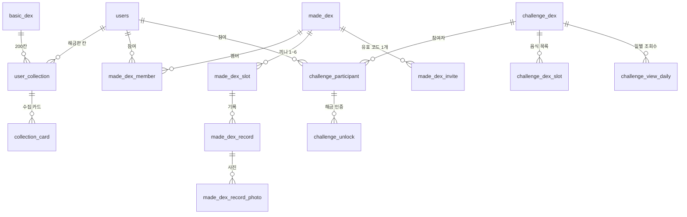

# 캣칫 CatchEat — Backend

> 먹은 음식을 사진으로 남겨 **도감으로 모으는** 수집형 기록 서비스

| | |
| --- | --- |
| 서비스 | <https://projectjm.co.kr> |
| API | <https://api.projectjm.co.kr> |
| API 문서 | <https://api.projectjm.co.kr/swagger-ui.html> |
| 프론트엔드 저장소 | [`AIBE6_FinalProject_Team02_FE`](https://github.com/prgrms-aibe-devcourse/AIBE6_FinalProject_Team02_FE) |
| 기간 | 2026-07-16 ~ 2026-08-28 |

---

## 목차

1. [프로젝트 개요](#1-프로젝트-개요)
2. [주요 기능](#2-주요-기능)
3. [기술 스택](#3-기술-스택)
4. [시스템 아키텍처](#4-시스템-아키텍처)
5. [주요 DB](#5-주요-db)
6. [API 명세서](#6-api-명세서)
7. [프로젝트 구조](#7-프로젝트-구조)
8. [Jira 협업 구조](#8-jira-협업-구조)

---

## 1. 프로젝트 개요

### 무엇을 만들었나

사진 한 장을 AI가 판별해 도감 칸을 열고, 그 기록을 혼자 또는 함께 쌓는다.
같은 "기록"이라도 **성격이 다른 세 종류의 도감**으로 나눴다.

| | **베이짓** | **로그잇** | **챌린짓** |
| --- |----| --- |---------|
| 성격 | 개인 수집 | 1~6인 **공동 기록** | 다인 참여 **시즌 경쟁** |
| 칸 목록 | 운영진 지정 **138칸 고정** | 유저가 직접 정의 | 개설자가 지정 |
| AI 판별 | O  | **X** | **X -> 위치 인증** |
| 진행률·수집률 | O  | **X** | O       |
| 소셜 | 없음 | 초대 · 댓글 · 좋아요 · 하루 카드 | 리뷰 · 좋아요 · 랭킹 |

### 팀 구성과 역할

| 이름 | 담당 영역 | 주요 도메인 |
| --- | --- | --- |
| 정연수 / [`@tke0329`](https://github.com/tke0329) | 인프라 · 로그잇 · 베이짓 · 알림 | `infra` `made` `dex` `notification` |
| 윤하빈 / [`@yunabin`](https://github.com/yunabin) | 로그잇 · 등록 플로우(AI 판별) · 일러스트 | `made` `registration` `illustration` |
| 신재희 / [`@SHINJAEHEE-DEV`](https://github.com/SHINJAEHEE-DEV) | 챌린짓 · 인증/인가 · 관리자 콘솔 | `challenge` `auth` `admin` |
| 김락현 / [`@Rakhyunn`](https://github.com/Rakhyunn) | 마이페이지 · 뱃지 · 로그잇 · 부하테스트 세팅 | `my` `badge` `made` `challenge` |

---

## 2. 주요 기능

<!-- ▼ 서비스 화면 캡처를 넣을 자리 (docs/images/) -->

| 베이짓 | 로그잇 | 챌린짓 |
| :---: | :---: | :---: |
|  |  |  |
| 138칸 도감 · 수집률 | 하루 식탁 · 하루 카드 | 위치 인증 · 랭킹 |

<!-- ▲ 서비스 화면 캡처 -->

### 2.1 등록 — 사진 한 장으로 도감 칸 열기

사진을 S3에 직접 올리고, 서버가 AI에게 "이 사진에 이 음식이 있는지" 판정을 맡긴다.

**핵심 구현 — 모델의 답을 어디까지 믿을지 정했다**

- 자유 텍스트를 파싱하지 않고 `response_format = json_schema (strict)`로 **응답 형태를 강제**한다.
  파싱은 실패 케이스가 무한하고 조용히 틀리지만, 스키마를 강제하면 실패가 스키마 위반으로 드러난다
- **AI 판정을 최종으로 두지 않았다.** 실패한 건은 증빙 사진과 실패 사유를 달고 관리자 검토 큐로 넘어가고,
  관리자가 수락하면 그때 수집 카드가 칸에 붙는다
- 형식은 스키마가, 내용은 사람이 — 신뢰 경계를 두 겹으로 그었다

### 2.2 베이짓 — 138칸 고정 도감

- 칸이 고정이라 **수집률이 성립한다.** 카테고리는 9종
- 수집률은 **칸 기준**이다. 같은 음식을 다시 수집하면 별(rank)만 오르고 수집률은 그대로다 (별 최대 3)
- 수집률을 저장하지 않고 **조회 시 계산**한다 — 기본 도감이 버전으로 확장되면 저장해 둔 수치는 전부 과거값이 된다

### 2.3 로그잇 — 여럿이 함께 쓰는 기록

**핵심 구현 ① 같은 끼니는 하루 한 번 — 앱 검사 + DB 제약 2중 방어**

규칙은 "한 사람이 한 끼니에 남기는 건 하루 한 건"(도감 × 끼니 × 사람 × 날짜)이다.
서비스에서 먼저 검사하지만 **동시 요청 둘은 그 검사를 함께 통과한다.** 그래서 최후 방어선은 DB에 뒀다.

```sql
CREATE UNIQUE INDEX uq_made_dex_record_slot_author_day
    ON made_dex_record (made_dex_id, slot_id, author_id, logged_on)
    WHERE deleted_at IS NULL;   -- 부분 인덱스 → 지운 기록은 자리를 비켜 준다
```

**핵심 구현 ② 초대 코드 — 잠근 뒤 다시 확인한다**

- 그룹당 유효 코드는 **하나**뿐이라 재발급하면 이전 코드가 그 자리에서 죽는다 (유효기간 7일)
- 참여는 그룹 행을 잠근 뒤 진행한다. 잠금을 기다리는 사이 그룹장이 재발급했을 수 있어 **잠근 뒤 코드를 다시 확인**한다
- 정원도 잠금 안에서 센다. 밖에서 세면 마지막 한 자리를 두 명이 함께 얻는다

**그 밖에** — 끼니(슬롯)는 그룹마다 이름과 개수가 달라 전역 enum이 아니라 테이블로 뒀다.
기록이 붙은 끼니는 지우지 않고 숨김 처리한다.

### 2.4 챌린짓 — 위치로 인증하는 시즌 경쟁

**핵심 구현 — 서버가 다시 검사하는 다섯 가지**

사진과 좌표를 받아 인증한다. 통과해야 하는 관문은 다섯이고 **거리 계산은 마지막**이다 — 앞의 네 검사가 훨씬 싸다.

1. 이 챌린지의 참여자인가 (완주 판정 동시성 때문에 참여자 행을 `FOR UPDATE`로 잠근 채 진행)
2. 이 챌린지의 슬롯인가
3. 이미 인증한 칸은 아닌가
4. 챌린지가 끝나지는 않았는가
5. **슬롯 좌표에서 80m 이내인가** (Haversine)

좌표는 클라이언트가 보낸다. 서버가 할 수 있는 건 거리 계산까지이며 **위조를 막지는 못한다** — 사진이 2차 근거다.

**그 밖에**

- 탐색 목록의 랭킹은 **최근 7일** 창에서 조회 · 신규 참여 · 해금 세 축으로 매긴다. 집계·정렬·페이징은 DB에서 끝낸다
- 보상 뱃지는 운영진 프리셋으로 고정하지 않고 **개설자가 직접 만들 수 있게** 열어 뒀다

### 2.5 인증/인가 — 토큰은 회전한다

- 소셜 로그인(Google · Kakao · Naver) 후 서비스 JWT를 **httpOnly 쿠키**로 발급 (access 30분 / refresh 14일), 세션은 STATELESS
- refresh는 DB가 아니라 **Redis**에 `RT:{userId}:{sid}`로 저장 — 만료가 이 데이터의 성격 자체이고 무효화가 즉시 필요하다
- `sid`(세션 식별자)를 기기별로 발급해 **한 기기만 로그아웃**시킬 수 있다
- 재발급은 **CAS(원자적 교체)** — 저장된 값이 방금 제시된 옛 refresh와 같을 때만 새 값으로 바꾼다
- 값이 다르면 이미 쓴 토큰이 다시 온 것이므로 **탈취로 보고 세션을 통째로 삭제**한다

### 2.6 마이페이지 · 알림 — 부가 기능이 핵심을 되돌리지 않게

마이페이지는 화면 하나지만 뒤로는 프로필 · 뱃지 · 활동 내역 · 친구 · 알림 다섯 도메인을 모은다.
닉네임은 **마지막 변경에서 한 달**이 지나야 바꿀 수 있고, 탈퇴는 **개인정보를 비식별화한 뒤 30일 동안 복구**할 수 있다.

**핵심 구현 — 트랜잭션 경계**

부가 기능(뱃지 지급 · 알림)이 실패했을 때 핵심 행동(기록 등록 · 댓글 작성)까지 롤백되면 안 된다.
그래서 부가 기능을 `AFTER_COMMIT` 이벤트로 분리해 **핵심이 확정된 뒤에** 돌게 했다.

```java
@Async
@TransactionalEventListener(phase = TransactionPhase.AFTER_COMMIT)
public void onCommentCreated(CommentCreatedEvent event) { ... }
```

`@Async`가 함께 필요한 이유 — AFTER_COMMIT 리스너는 이미 트랜잭션 밖이라 그 콜스택에서 저장하면 `No active transaction`이 난다.

각 도메인은 알림 서비스를 직접 호출하지 않고 **이벤트만 발행한다.** 로그잇은 알림의 존재를 모른다.
한 트랜잭션에 넣을지 가르는 기준은 하나다 — **실패했을 때 되돌려야 하는가.**

### 2.7 동시성 방어 모음

| 상황 | 방어 |
| --- | --- |
| 같은 끼니 중복 등록 | 앱 선검사 + **부분 유니크 인덱스**, 위반을 409로 변환 |
| 닉네임 중복 (검사와 저장 사이의 틈) | 앱 검사 + DB UNIQUE, `saveAndFlush`로 409 변환 |
| 친구 관계 유일성 (방향이 없다) | 정렬쌍 함수 인덱스 `(LEAST, GREATEST)` |
| 마지막 슬롯 동시 해금 시 완주 유실 | 참여자 행 **비관적 락**으로 판정 구간 직렬화 |
| 초대 코드 정원 초과 | 그룹 행 잠금 + `uk_made_dex_member` |

> 완료 판정은 자식 테이블(`challenge_unlock`) 집계라 낙관적 락으로는 못 잡는다 — 자식 insert가 부모 버전을 올리지 않기 때문이다.

---

## 3. 기술 스택

| 구분 | 사용 기술 |
| --- | --- |
| 언어 · 런타임 | Java 21 (Eclipse Temurin) |
| 프레임워크 | Spring Boot 4.1.0 · Spring Web MVC · Spring Data JPA |
| 빌드 | Gradle (Kotlin DSL) |
| 데이터베이스 | PostgreSQL 16 · Flyway (마이그레이션 57개 · 테이블 41개) |
| 캐시 · 세션 | Redis 7 (refresh 토큰 저장 · 회전) |
| 인증 | Spring Security · OAuth2 Client (Google · Kakao · Naver) · JJWT |
| AI | Spring AI · OpenAI `gpt-4o-mini`(비전 판별) · `gpt-image-1-mini`(일러스트) |
| 파일 저장 | AWS S3 (presigned URL 직업로드) |
| 실시간 | WebSocket · STOMP (`/ws` → `/queue/notifications`) |
| 외부 API | 카카오 로컬 (장소 검색 · 지오코딩) |
| API 문서 | springdoc-openapi **3.x** (Swagger UI) |
| 관측 | Spring Actuator · Micrometer · Prometheus · Grafana |
| 인프라 | Docker · Amazon ECR · AWS EC2 · nginx · Let's Encrypt · GitHub Actions |

---

## 4. 시스템 아키텍처

<!-- ▼ 아키텍처 다이어그램 (docs/images/architecture.png) -->


<!-- ▲ 아키텍처 다이어그램 -->

**클라이언트 → 인그레스**
nginx가 Let's Encrypt 인증서로 HTTPS(443)를 받아 프론트(3000)와 백엔드(8080)로 나눠 보낸다.

**EC2 (Docker Compose)**
애플리케이션과 데이터 저장소가 한 인스턴스 위 컨테이너로 함께 뜬다. Spring Boot ↔ PostgreSQL(5432) · Redis(6379).

**외부 서비스**
S3(이미지 저장) · OpenAI(비전 판별) · OAuth 2.0(소셜 로그인) · IAM(권한).
사진은 **API 서버를 통과하지 않는다.** 서버는 권한을 확인하고 presigned URL만 발급하며 업로드는 브라우저 → S3로 직접 간다.

**CI/CD**
`Local IDE → GitHub → GitHub Actions → ECR → EC2(docker pull · compose up)`.
`main` push는 prod 스택, `develop` push는 dev 스택으로 나간다.

**관측**
Spring Boot(Actuator) → Prometheus → Grafana.
Actuator는 `health` · `prometheus` **둘만**, 그리고 **9091 루프백 전용**으로 연다 — `env` · `configprops` · `heapdump`가 함께 열리면 DB 비밀번호 · JWT 시크릿 · OAuth 시크릿 · AWS 키가 그대로 담긴다.

---

## 5. 주요 DB

테이블은 41개다. 전부 나열하는 대신 **도감 3종의 뼈대**와 그 위에 걸어 둔 제약만 본다.



### 그룹별 주요 테이블

| 그룹 | 테이블 | 역할 |
| --- | --- | --- |
| 사용자 | `users` `user_badge` `badge` `user_guide_seen` | 계정 · 뱃지 보유 · 온보딩 가이드 |
| 베이짓 | `basic_dex` `basic_dex_alias` `user_collection` `collection_card` | 138칸 정의 · 별칭 사전 · 해금한 칸 · 수집 카드 |
| 로그잇 | `made_dex` `made_dex_slot` `made_dex_member` `made_dex_invite` `made_dex_record` `made_dex_record_photo` `made_dex_comment` | 그룹 · 끼니 · 멤버 · 초대 · 기록 · 사진 · 댓글 |
| 챌린짓 | `challenge_dex` `challenge_dex_slot` `challenge_participant` `challenge_unlock` `challenge_view_daily` `challenge_ticket` | 챌린지 · 음식 슬롯 · 참여자 · 인증 · 조회 집계 · 개설권 |
| 소셜 · 알림 | `friendship` `notification` `review` `review_like` | 친구 · 알림 · 리뷰 |
| 운영 | `food_registration_requests` `unidentified_food_report` `review_queue_item` | 관리자 검토 큐 |
| 미디어 | `photo` `card_photo` `upload_object` `illustration_job` | 사진 · S3 객체 · 일러스트 작업 |

### 도메인 규칙을 지키는 제약

| 제약 | 무엇을 지키나 |
| --- | --- |
| `uq_made_dex_record_slot_author_day`<br/>`(made_dex_id, slot_id, author_id, logged_on) WHERE deleted_at IS NULL` | 같은 끼니 하루 한 건. **부분 인덱스**라 지운 기록은 자리를 비켜 준다 |
| `uk_made_dex_invite_code` | 초대 코드 충돌의 최종 방어선 (31⁶ 공간 + 재시도 5회) |
| `uk_made_dex_member` | 같은 사람이 두 번 눌렀을 때의 중복 참여 |
| `friendship` 정렬쌍 함수 인덱스 `(LEAST, GREATEST)` | 방향이 없는 친구 관계의 유일성 |
| `challenge_unlock (참여자, 슬롯)` UNIQUE | 같은 칸 중복 인증 |
| `user_collection (user_id, slot_id)` | 칸 기준 수집률 — 중복 수집은 카드만 늘고 칸은 늘지 않는다 |

---

## 6. API 명세서

| | |
| --- | --- |
| **Swagger UI** | <https://api.projectjm.co.kr/swagger-ui.html> |
| 스펙 JSON | <https://api.projectjm.co.kr/v3/api-docs> |
| 로컬 | <http://localhost:8080/swagger-ui.html> |

**25개 그룹 · 114개 오퍼레이션**에 한국어 이름과 설명이 붙어 있다.
그룹 설명에는 그 도메인의 **불변 규칙**을 함께 적어 두었다 — 「로그잇 · 기록」을 펼치면
"기록의 단위는 음식이 아니라 사람이다"가 먼저 보인다.

| 그룹 | 오퍼레이션 |
| --- | ---: |
| 인증 · 온보딩 | 6 |
| 베이짓 (기본 도감 · 별칭) | 4 |
| 등록 · AI 판별 | 2 |
| 로그잇 (도감 · 끼니 · 기록 · 댓글 · 하루 카드 · 식탁) | 32 |
| 챌린짓 (도감 · 리뷰 · 보상 뱃지) | 21 |
| 마이페이지 · 사용자 · 뱃지 | 18 |
| 친구 · 알림 | 11 |
| 업로드 · 장소 · 메모 · 일러스트 · 제보 | 14 |
| 관리자 | 6 |

---

## 7. 프로젝트 구조

```
backend_catcheat/
├── src/main/java/com/backend_catcheat/
│   ├── domain/                    # 도메인 16개
│   │   ├── auth · onboarding      # 소셜 로그인 · JWT · 첫 방문 가이드
│   │   ├── dex                    # 베이짓 (200칸 · 수집 카드 · 별칭)
│   │   ├── registration           # 등록 플로우 (AI 판별 → 칸 해금)
│   │   ├── made                   # 로그잇 (공동 기록 · 끼니 · 댓글 · 하루 카드)
│   │   ├── challenge              # 챌린짓 (위치 인증 · 랭킹 · 리뷰 · 보상 뱃지)
│   │   ├── friend · notification  # 친구 · 알림
│   │   ├── my · user · badge      # 마이페이지 · 공개 프로필 · 뱃지
│   │   ├── illustration           # AI 일러스트 생성
│   │   ├── place · memo · upload  # 장소 검색 · 메모 템플릿 · S3 presigned
│   │   └── admin                  # 관리자 콘솔 (제보 큐 · 등록 요청 큐)
│   └── global/
│       ├── security · jwt         # 시큐리티 설정 · JWT 필터
│       ├── common · exception     # ApiResponse 봉투 · ErrorCode
│       ├── event                  # 도메인 간 이벤트 (AFTER_COMMIT)
│       ├── websocket · s3         # STOMP 설정 · presigned 서비스
│       └── config · jpa           # OpenAPI · 비동기 · 시간대 · BaseEntity
├── src/main/resources/db/migration # Flyway 57개
├── load-test/                      # k6 시나리오
├── monitoring/                     # Prometheus · Grafana 구성
├── docs/                           # 스펙 · 계획 · 이미지
├── docker-compose.yml              # 로컬 (postgres · redis)
├── docker-compose.dev|prod.yml     # 배포 스택
└── Dockerfile                      # 멀티스테이지 (jdk 빌드 → jre 실행)
```

도메인 하나는 `controller / service / repository / entity / dto`로 나뉜다.
컨트롤러는 요청 · 응답만 담당하고 로직은 서비스에 위임한다.
**유저 식별은 항상 `@AuthenticationPrincipal Long userId`** 로 하며 요청 본문의 userId는 믿지 않는다.

### 실행

```bash
docker compose up -d          # postgres + redis
cp .env.example .env          # 값을 채운다 (최소 JWT_SECRET)
./gradlew bootRun             # http://localhost:8080
```

| 환경 변수 | 없으면 |
| --- | --- |
| `JWT_SECRET` | 애플리케이션이 기동하지 않는다 (필수) |
| `GOOGLE_CLIENT_ID` / `_SECRET` 등 | 해당 소셜 로그인만 실패 |
| `OPENAI_API_KEY` | AI 판별 · 일러스트 생성 불가 |
| `AWS_S3_BUCKET` · `AWS_REGION` · 액세스 키 | 사진 업로드 불가 |
| `KAKAO_REST_API_KEY` | 장소 검색 불가 |
| `TEST_LOGIN_ENABLED=true` | 심사용 로그인이 404 (Swagger 시험 시 필요) |

> 런타임 이미지에 `libheif` + `libde265`를 설치한다 — 아이폰 HEIC 원본을 ImageIO가 읽지 못해 `heif-convert`로 JPEG를 거치기 때문이다.

---

## 8. Jira 협업 구조

### 이슈 → 브랜치 → PR → 릴리즈

```
Jira 이슈 CATCHEAT-00
   └─ 브랜치  CATCHEAT-00/feat/담당자
        └─ PR (squash merge) → develop
             └─ 릴리즈 PR → main → [Release] Vn
```

브랜치 이름을 `CATCHEAT-<이슈번호>/<타입>/<담당자>`로 고정해서
**브랜치 · PR · 커밋이 전부 하나의 이슈 키로 이어진다.** 타입은 `feat` · `fix` · `chore`.

| 규칙 | |
| --- | --- |
| `main` | 보호. 직접 push · force push 금지 |
| 작업 → `develop` | PR + **squash merge** |
| `develop` → `main` | 릴리즈 PR, `[Release] Vn` 커밋으로 남긴다 |
| PR 본문 | 관련 이슈 / 작업 내용 / 스크린샷 · 테스트 결과 / 리뷰 포인트 (템플릿 4섹션) |

<!-- ▼ Jira 캡처 (docs/images/) -->

**타임라인 및 하위 목록 구성**


**보드**


<!-- ▲ Jira 캡처 -->

### 코드 리뷰

PR마다 팀원 1명 이상의 리뷰를 거쳤고, CodeRabbit 자동 리뷰도 함께 받았다.
